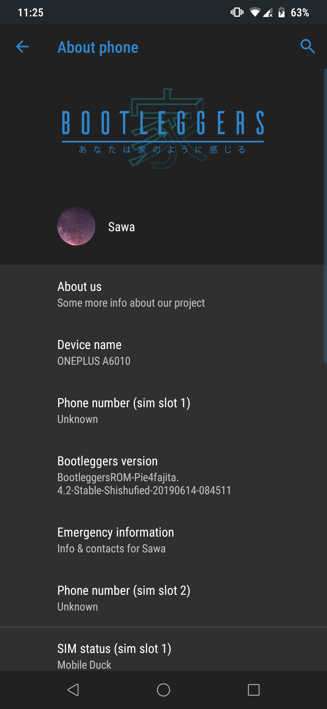

# OnePlus6T Custom Rom Flashing Guide

## 前言

有幾個常見Terms想記低先，事關自己記性真心差，經常轉個頭就唔記得嘢。

OOS = Oxygen OS嘅縮寫。

A/B partition = 算係新嘢嚟，用嚟實現seamless system update，下面會詳細講。

Encryption = 唔係咩新嘢，Android 5.0 已經support full system encryption。

Bootleggers = Rom一個，「Trying to make you feel like 家」，注意我提供嘅Bootleggers係Force Encryption Version （已存在喺/data partition嘅舊Data會被格式化☺）。

Rom Packages：https://drive.google.com/file/d/1yIr3PBBDCSGeeQqsQ6GqJ_e4KNExOwkB/view?usp=sharing

Unbrick tools : https://drive.google.com/file/d/150K60ZUd4WRlpVr0SwX7gvhvLz6zM9qe/view?usp=sharing

https://www.google.com/search?client=firefox-b-d&q=msmdownloadtool+oneplus+6t

### Oneplus 6T 變磚點算? How to Unbrick?

變磚一貫（我諗亦都係最後）手段係用所謂「線刷」，