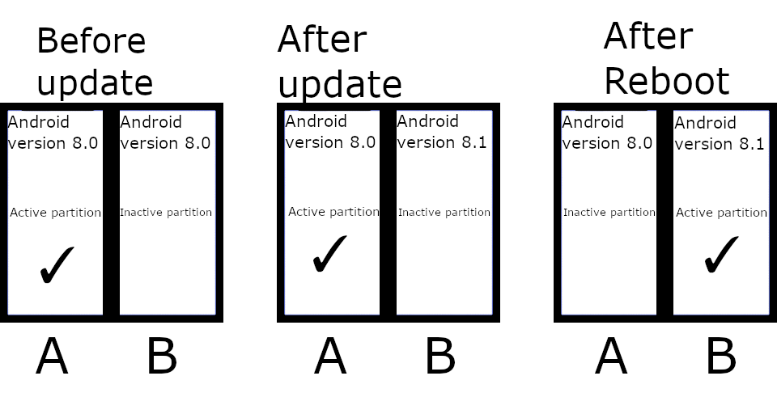

# OnePlus6T Custom Rom Flashing Guide

<p align="center"></p>
<br>

## 前言

有幾個常見Terms想記低先，事關自己記性真心差，經常轉個頭就唔記得嘢。

OOS = Oxygen OS嘅縮寫。

A/B partition = 算係新嘢嚟，用嚟實現seamless system update，下面會詳細講。

Encryption = 唔係咩新嘢，Android 5.0 已經support full system encryption。

Seamless update = 無縫系統更新，OTA更新嗰陣唔需要打斷當前進行嘅Task。

OTA升級 = Over-The-Air，線上收到Push包升級，都會簡單講下。

Bootleggers = Rom一個，Slogan係「Trying to make you feel like 家」。注意提供嘅Bootleggers係Force Encryption Version （⚠已存在喺/data partition嘅舊Data會被格式化，/data分區強制加密⚠）。

=======================================================================================

下面提供我依家用緊嘅Packages，Download link 係google drive嚟 (因為太大放唔到上github)。

| Rom Packages DL Link   | **Include Packages**                                         |
| ---------------------- | ------------------------------------------------------------ |
| https://bit.ly/2JTBjCq | BootleggersROM-Pie (fajita) 4.2 stable - [20190614-08:45:11 Build] |
|                        | OnePlus6T Oxygen 34 OTA (Strock Rom)                         |
|                        | Open GApps ARM64 9.0 Pico                                    |
|                        | TWRP 3.3.1-1 (fajita) Image                                  |
|                        | TWRP 3.3.1-0 (fajita) Installer                              |
|                        | Magisk-v19.3 (Force Encryption)                              |

| Unbrick tools DL Link <br/>(For Windows, command-line) | Include Packages                                     |
| ------------------------------------------------------ | ---------------------------------------------------- |
| http://bit.ly/2OaijoI                                  | OnePlus6T Oxygen 34 OTA (FASTBOOT Flashing firmware) |
|                                                        | adb.exe & fastboot.exe & more misc required tools    |

另外有一個GUI tools for unbrick嘅叫[msmdownloadtool](https://www.google.com/search?client=firefox-b-d&q=msmdownloadtool+oneplus+6t)，不過我自已試過，唔係好work（汗）
有興趣可以google下，不過我比較信上面嘅commnad-line tools多啲。


刷機嚟講都係用adb tools已經夠哂：

```bash
# For Arch Linux only
sudo pacman -S android-tools
```


=======================================================================================


## OTA（Over-The-Air）系統升級

一種分發系統升級包、設定檔、安全性patch等檔安嘅方法。由中央伺服器發放到User Devices。OTA更新會**移除Root Access**，如果你想留翻低Root Access，某啲APPS係可以做到，不過我都係建議手動Root多次。

OTA更新實際上係你reboot嘅時侯發生（Download完OTA更新檔，System會要求你reboot）。部機會reboot入recovery先，再由recovery flash 頭先Download咗嘅OTA Push。係呢個moment，使用者可能會等一段比較長嘅時間（如果係大更新）。呢種舊嘅OTA更新一旦出現問題，極度有可能會因更新失敗污染系統，從而發生Bootloop，入唔到正常畫面 （半磚狀態）。 

為咗解決呢個問題，新嘅手機大部分都彩用咗Google建議嘅A/B partition scheme，同時實現到**Seamless Update**以及更新失敗嗰陣嘅**系統還原**。


## 咩係Seamless Update呢?

即係**無縫更新**，你唔需要reboot部機入recovery mode去等佢慢慢更新，而係run緊部機個陣已經同時進行更新（當然你最後都係要reboot）。Chrome OS都係行緊呢套。背後實現呢一樣功能其實同A/B partition有極大嘅關系。


## 究竟乜嘢係A/B partition?



A/B parition，字面上睇都知係講緊有兩 set partitions，A同B。每次只會有一個partition係active。假設依家係用緊A partition，咁OTA Update就會write落B partition到，亦都因為咁樣呢個process唔會影響到目前用緊既partition，所以亦都叫seamless update。Update完成之後只需要reboot，咁recovery就會set active partition由A 變做 B，然後部機就boot入partition B嘅OS。換言之依家B partition會係最update嘅OS，而A partiton會係未apply OTA update嘅OS。呢個概念同dual boot係有啲似，即係Nexus 5 年代嘅機玩緊嘅multirom。

一旦OTA Update出問題，冇有怕，Recovery識得fallback番去之前嘅A partition。雖然A partiton唔係最新嘅狀態，但至少咁樣可以ensure到部機冇咁易因為OTA Update而變磚。

而要留意既係data partition會係shared with both A同B parition，即係2個OS都係共用一堆APPs，User data（圖片，檔案，etc）。

更多嘅講解可以睇翻xda各路高手嘅文章。


## Flashing Custom ROM Tutorial

下載完上面嗰堆Rom packages之後，再裝埋adb就可以開波。

要提一提嘅係One Plus 6T刷機（或者話A/B partition scheme嘅刷機）都最好要有stock rom，因為呢一代嘅機刷機觀念唔太一樣：依家係好似砌LEGO咁，要有一個base，然後其他嘢慢慢疊呀疊咁砌上去；而我哋嘅base就係stock rom (latest version OOS)，用佢做底可以ensure firmware齊哂冇漏。另一個原因係因為今次刷嘅ROM係bootleggers，official guideline寫明要刷OOS先咁就最好跟一跟（不過好似有人試過唔刷都OKAY?）。亦有啲ROM可能會指明唔係刷OOS先，而係AOSP都唔出奇，反正照做就OK。

Flashing Instructions:

```bash
1. Download the ROM
2. Download GAPPS
3. Download Twrp
4. Go to recovery and TAKE A NANDROID BACKUP
5. Wipe Data and Cache
6. Flash OOS + TWRP
7. Reboot to twrp
8. Wipe data, cache(system optional)
6. Flash ROM + twrp
7. reboot to twrp. This is compulsory
8. Now flash additional addons like gapps and magisk.
9. Reboot and profit
```


詳細點做，可以睇教學片：


<br><br><br><br>

## Oneplus 6T 變磚點算 ? How to Unbrick?

變磚一貫（我諗亦都係最後）一道防線係用所謂「線刷」。簡單嚟講就係要用到你部電腦，有一個work嘅rom image（對應好哂partition），然後將部brick咗嘅機入Fastboot mode，用usb線連fastboot直接寫入去flash到。具體操作係配合adb shell用dd if=xxx of=xxx command。


#### Windows上嘅Unbrick工具

主要都係用翻上面條DL Link嗰個Tools (另一個叫「msmdownloadtool」嘅我自己就失敗咗，有興趣可以自行研究)。呢個方法適用於Windows，不過其實Linux都係差唔多咁上下，都係照跟翻fastboot command 寫成script，有機會遲啲再寫個。

解壓咗`9.0.12-OnePlus6TOxygen_34_OTA_019_all_1901231347_fb09dd2d4-FASTBOOT.zip`之後>`Others_flashall` > `flash-all-partitions.bat`

Run呢個batch scrtip，之後都係跟住prompt instruction，同埋等就ok。你會見到佢係將A/B partition都flash翻stock rom落去，以及stock recovery。

   

   

   

References:

https://forum.xda-developers.com/oneplus-6/how-to/guide-noobs-guide-to-b-partitions-op6-t3816123

https://www.xda-developers.com/how-a-b-partitions-and-seamless-updates-affect-custom-development-on-xda/

https://forum.xda-developers.com/oneplus-6t/help/bricked-oneplus-6t-msmdownloadtool-t3900145

https://www.youtube.com/watch?v=Jq1NBuOy0Mk&list=LLkOs4YUlGA01wI2NEng1f-g&index=91&t=0s
